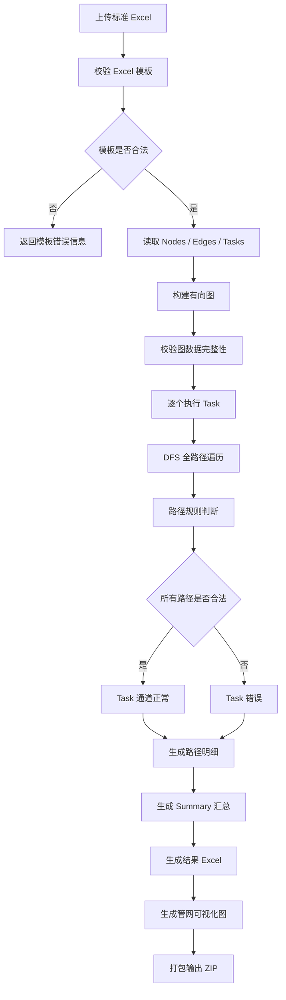

# PipeFlowCheck 项目优化方案

## 一、项目名称
**项目全称**：城市排水管网流向合规性检测系统  
**简称**：PipeFlowCheck

---

## 二、项目目标
1. **输入**：Excel 文件，包含标准三张表：Nodes、Edges、Tasks（必须）。
2. **处理**：
   - 构建有向图；
   - 从 Tasks 表中指定入口节点开始执行全路径 DFS 遍历；
   - 按固定规则判断路径合法性（雨水/污水/合流）；
   - 所有下游路径必须合法，否则任务判定错误。
3. **输出**：
   - Excel 文件：路径明细、任务汇总、错误原因；
   - 可视化管网图（PNG/SVG）；
   - 打包 ZIP 输出结果。

---

## 三、核心规则
### 3.1 雨水入口规则
- 允许通道：RAIN、SEWAGE、COMBINED
- 终点判断：
  - 如果只经过 RAIN：合法终点 RIVER、LAKE、RAIN_OUTLET
  - 一旦经过 SEWAGE 或 COMBINED：合法终点必须是 WWTP（污水处理厂）

### 3.2 污水入口规则
- 允许通道：SEWAGE、COMBINED
- 合法终点：WWTP

### 3.3 扩展规则
- 当前阶段不做复杂规则扩展，保持规则固定

---

## 四、Excel 输入设计
### 4.1 Nodes 表
| node_id | node_name | node_type | remark |
|---------|-----------|-----------|--------|
| N001    | 雨水口1   | RAIN_INLET | 北门雨水口 |
| N002    | 雨水井1   | RAIN_WELL  | 中转井 |
| N003    | 河流1     | RIVER      | 合法终点 |
| N004    | 污水口1   | SEWAGE_INLET | 小区污水口 |
| N005    | 污水处理厂 | WWTP      | 合法终点 |

### 4.2 Edges 表
| from_node_id | to_node_id | channel_type | remark |
|--------------|------------|--------------|--------|
| N001         | N002       | RAIN         | 雨水通道 |
| N002         | N003       | RAIN         | 入河 |
| N004         | N005       | SEWAGE       | 进入污水处理厂 |

### 4.3 Tasks 表（必须）
| task_id | start_node_id | start_type | remark |
|---------|---------------|------------|--------|
| T001    | N001          | RAIN       | 检查雨水口1 |
| T002    | N004          | SEWAGE     | 检查污水口1 |

> Tasks 表固定存在，系统不自动推断入口。

---

## 五、输出 Excel 设计
### 5.1 汇总 Sheet
| task_id | start_node_id | start_node_name | final_status | error_count | path_count | summary |
|---------|---------------|----------------|--------------|-------------|------------|---------|

### 5.2 路径明细 Sheet
| task_id | path_no | start_node_id | end_node_id | end_node_name | status | node_path | channel_path | readable_path | error_reason |
|---------|---------|---------------|-------------|---------------|--------|-----------|--------------|---------------|--------------|

> readable_path 示例：`雨水口1(N001) --RAIN--> 雨水井1(N002) --RAIN--> 河流1(N003)`

---

## 六、项目流程

---

## 七、可视化方案
- 使用 Graphviz 生成 SVG/PNG；
- 节点颜色区分类型：雨水口=蓝色、污水口=黑色、合流井=灰色、污水处理厂=绿色、河流/湖泊=浅蓝色；
- 错误路径边标红；
- 每个 Task 可输出子图。

---

## 八、优化建议
1. Tasks 表固定存在，入口明确；
2. Excel 模板固定，列名暂不做映射；
3. CheckContext 保存路径节点及通道信息，并支持 passedChannelTypes；
4. 输出路径增加 readable_path；
5. 增加可视化图输出；
6. 支持最大深度和最大路径数保护；
7. 增加详细错误码，例如：PATH_TOO_DEEP、TERMINAL_HAS_DOWNSTREAM、CHANNEL_NOT_ALLOWED。

---

## 九、最终推荐定位
- 标准 Excel 模板输入；
- Tasks 明确指定入口；
- DFS 全路径检测，所有下游路径必须合法；
- 雨水进入污水/合流后必须抵达污水处理厂；
- 输出 Excel + 可视化图 + ZIP 打包；
- 保持规则固定，简洁可控。
